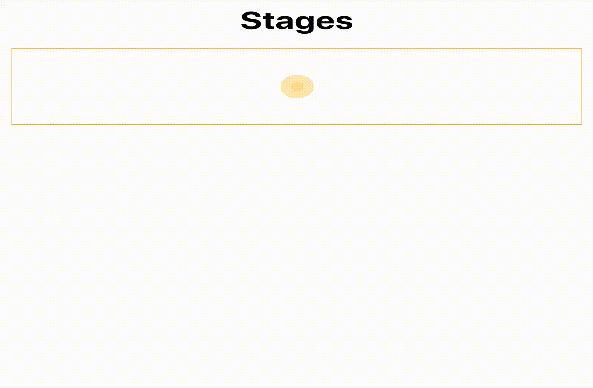

# React Stages

Você deverá reproduzir o mesmo comportamento deste [vídeo](https://drive.google.com/file/d/1pP5LeLh5WOuqIoRQIIndKCPITM63GA70/view?usp=sharing) também disponível no _gif_ abaixo:

  

## Regras

- ⚠️ &nbsp; Utilize o arquivo `data.json` para construir as suas etapas.
- ⚠️ &nbsp; Escreva testes.
## Bônus

- ⏲ &nbsp; Renderizar uma mensagem no componente `Parent` após o término do ciclo com a duração exata...

## Observações

- 🧐 &nbsp; O projeto já tem uma estrutura inicial para facilitar o desenvolvimento. Por exemplo, sugerimos usar o [styled-minimal](https://github.com/gilbarbara/styled-minimal) nos estilos, uma vez que já tem os recursos necessários. Mas fique à vontade para usar outra solução e realizar qualquer tipo de ajuste.
